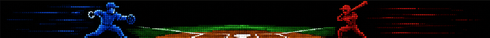

# Pitch Battle

Pitch Battle is a self-contained tabletop baseball game. Players connect their phones to a local Wi-Fi network, choose pitch and swing options, and the host resolves each at-bat. Results appear on the phones and on an external iPixel LED display.

The game needs no laptop, internet connection, or cloud services during play.

See [project_history.md](project_history.md) for how the Mac prototype was ported to ESP32 and what was completed along the way.

---

## Current State

### Working

- **Wi-Fi access point** — SSID `PitchBattle`, password `pitchbattle`
- **Captive portal** — DNS redirect plus probe routes for Android and iOS
- **Round LCD** — Full-screen animated `esp_screen.gif` on boot (GC9A01, 240×240)
- **Phone web UI** — JPG slice design (`src/index.html`); join screen, live scoreboard, pitch/swing controls, result panel
- **Web assets in firmware** — JPG backgrounds and HTML embedded via `setup/generateWebAssets.py` (runs before each build)
- **Team assignment** — First phone = Home, second = Away; roles follow the inning half
- **Server-side role enforcement** — Only the pitching team can pitch; only the batting team can swing
- **REST API** — Join, pitch, swing, state, reset, and new-game endpoints
- **At-bat resolution** — Weighted outcome lookup from `setup/pitching-battle-outcomes.json` (81 pitch/swing combos)
- **Game state** — Inning, score, count, outs, and base runners persist across at-bats
- **Walks and strikeouts** — Four balls advances the batter; three strikes records an out
- **iPixel display** — Logo on boot, GIF result animations, scroll text for walk/strikeout, live scoreboard on slot 5
- **Live scoreboard** — 96×16 template with visit/home rows, count colors, base runners, and on-device PNG push
- **Next-pitch flow** — Result screen + **Next Pitch** button calls `/api/reset`

### Known rough edges

- `resultText` is not escaped when building JSON responses
- `platformio.ini` includes machine-specific serial ports; change for your setup
- iPixel commands use raw ATT handle `0x0006` on this unit
- iPixel notify ACKs never arrive on the ESP32 link; firmware treats a fully-written window as success
- On-device PNG compression uses a fixed-Huffman DEFLATE encoder in `src/scoreboard.cpp` (ROM miniz cannot allocate on ESP32-C3)
- **New Game** is not yet exposed in the phone UI (API exists at `/api/new-game`)

---

## Hardware

### ESP32-C3 DevKitM-1

Hosts Wi-Fi, web server, game engine, iPixel BLE client, and the round LCD attract screen.

### Round LCD (onboard)

1.28 inch 240x240 round IPS TFT, GC9A01 driver. Pin mapping in `include/config.h`. Set `ENABLE_LCD` to `0` to test the web server without the display.

### iPixel display (external)

96x16 flexible LED matrix over BLE. GIF slots persist across power cycles. Slot 5 is overwritten each turn with the live scoreboard PNG. Upload GIF assets with `setup/storeImages.py`.

### Phones

1. Connect to Wi-Fi `PitchBattle` (password `pitchbattle`)
2. Open the captive portal or go to `http://192.168.4.1`
3. Tap Join Game — first phone is Home, second is Away

---

## Architecture

```text
  Phone (Home team)            Phone (Away team)
         |                            |
         +------------+---------------+
                      |
                      v
              ESP32-C3 firmware
         +-------------------------+
         |  Wi-Fi AP + portal      |
         |  Web server + UI        |
         |  Game engine            |
         |  Round LCD (esp_screen.gif) |
         |  BLE client (iPixel)    |
         +-------------------------+
                      |
                      v
              iPixel LED display
         (GIF animations, scroll text,
          live scoreboard on slot 5)
```

---

## Build and Run

Requires [PlatformIO](https://platformio.org/).

```bash
cd pitch_battle
pio run -t upload
pio device monitor
```

Serial monitor runs at 115200 baud.

After flashing:

1. Connect your phone to Wi-Fi network `PitchBattle`
2. Password: `pitchbattle`
3. The captive portal should open automatically; if not, go to `http://192.168.4.1`

---

## API

| Method | Path            | Description                           |
| ------ | --------------- | ------------------------------------- |
| `GET`  | `/`             | Game web UI                           |
| `GET`  | `/phone_*.jpg`  | Phone UI background slices (embedded) |
| `POST` | `/api/join`     | Claim a team (Home first, then Away)  |
| `GET`  | `/api/state`    | Current game state (JSON)             |
| `POST` | `/api/pitch`    | Lock pitch selection (pitching team)  |
| `POST` | `/api/swing`    | Lock swing selection (batting team) |
| `POST` | `/api/reset`    | Reset locks and start a new at-bat  |
| `POST` | `/api/new-game` | Reset the full scoreboard/game state |

### Teams and roles

Each phone posts a random `token` (stored in `localStorage`) to `/api/join`. First token claims **Home**, second claims **Away**; further phones get `{"team":"full"}`. A reload reclaims the same team via the saved token.

| Half   | Home  | Away  |
| ------ | ----- | ----- |
| Top    | Pitch | Bat   |
| Bottom | Bat   | Pitch |

Wrong-team requests return `403` with `{"error":"..."}`.

### Request bodies

Join:

```json
{ "token": "p-ab12cd34" }
```

Pitch:

```json
{ "height": "high", "speed": "fast", "token": "p-ab12cd34" }
```

Swing:

```json
{ "height": "middle", "timing": "medium", "token": "p-ab12cd34" }
```

`height`: `high`, `middle`, `low`  
Pitch `speed`: `fast`, `medium`, `slow`  
Swing `timing`: `fast`, `medium`, `slow`

### State response

```json
{
  "pitchLocked": true,
  "swingLocked": false,
  "result": "",
  "image": "waiting",
  "inning": 1,
  "half": "top",
  "homeScore": 0,
  "awayScore": 0,
  "balls": 0,
  "strikes": 0,
  "outs": 0,
  "runnerFirst": false,
  "runnerSecond": false,
  "runnerThird": false
}
```

When both players lock, `result` holds the outcome text and `image` selects the iPixel display:

| `image` value | iPixel behavior |
| ------------- | --------------- |
| `homerun`, `triple`, `double`, `single` | Stored GIF slot |
| `ball`, `strike` | Ball animation (slot 6) |
| `foul` | Foul animation (slot 7) |
| `flyout`, `groundout`, `out` | Flyout (slot 8) or ground out (slot 9) |
| `walk` | Scrolling text `"WALK"` |
| `strikeout` | Scrolling text `"STRIKEOUT"` |
| `waiting` | No result yet |

Scoreboard fields persist until `/api/new-game`.

### Captive portal routes

`/generate_204`, `/hotspot-detect.html`, `/connecttest.txt`, `/canonical.html`, `/ncsi.txt`, `/fwlink`, `/success.txt`, `/favicon.ico`

---

## Phone web UI

Design source: `src/index.html`. Background art: `src/phone_*.jpg` (~85 KB total, JPEG).

After editing HTML or JPGs, regenerate embedded assets (PlatformIO does this automatically before build):

```bash
python3 setup/generateWebAssets.py
pio run -t upload
```

The UI scales a fixed 953px-wide layout to the phone viewport. Screens:

1. **Join** — header + Join Game button
2. **Play** — scoreboard, field, PVP status, pitch/swing pickers, lock-in button
3. **Result** — outcome text in the choice panel + Next Pitch

---

## Outcome lookup table

Play results come from `setup/pitching-battle-outcomes.json` (81 pitch height/speed × swing height/timing combos, weighted responses).

Regenerate the firmware lookup after editing the JSON:

```bash
python3 setup/generateOutcomes.py
```

This writes `include/pitch_outcomes_data.h`. Walks and strikeouts are still derived from the count after a ball/strike outcome, not from the JSON table.

---

## iPixel

### Display flow

1. **Boot** — connect over BLE, show logo (slot 10)
2. **Result** — play the matching GIF slot, or scroll text for walk/strikeout
3. **Return** — after 5 seconds (`IPIXEL_SCOREBOARD_RETURN_MS`), push live scoreboard PNG to slot 5, call `show_slot(5)`

### Slot assignments

| Slot | Content |
| ---- | ------- |
| 1 | Homerun |
| 2 | Triple |
| 3 | Double |
| 4 | Single |
| 5 | **Live scoreboard** (firmware, each turn) |
| 6 | Ball |
| 7 | Foul |
| 8 | Flyout |
| 9 | Ground out |
| 10 | Logo |

Walk and strikeout use scroll-text BLE frames, not stored slots.

### Mac setup scripts

Close the iPixel Color app and power off the ESP32 before running (one BLE connection at a time):

```bash
python3 setup/storeImages.py
python3 setup/generateScrollTextPayloads.py   # after changing walk/strikeout text
```

`storeImages.py` scans for `LED_BLE_*`, uploads GIFs from `setup/`, and skips slot 5.

### Power-on sequence

1. Turn on the iPixel and wait for it to finish booting
2. Close the iPixel Color phone app
3. Power on or flash the ESP32
4. ESP32 scans for BLE (~18 s boot window), then keeps retrying every 30 s until the logo appears
5. Logo should hold steady on the iPixel once connected

| Screen state | Meaning |
| ------------ | ------- |
| Blinking blue link icon | iPixel advertising — good time to connect |
| Animations cycling, no link icon | Not advertising; ESP32 cannot connect |
| Logo holding steady | ESP32 connected, slot 10 sent |

If the iPixel is stuck cycling animations, reset from a Mac:

```bash
python3 -m pypixelcolor --scan
python3 -m pypixelcolor -a <your-device-id> -c show_slot 10
```

Then power-cycle the ESP32 while the iPixel is idle.

### Configuration

Key flags in `include/config.h`:

| Flag | Purpose |
| ---- | ------- |
| `ENABLE_IPIXEL` | Set `0` to disable BLE |
| `IPIXEL_DEVICE_PREFIX` | Scan filter, default `LED_BLE_` |
| `IPIXEL_MAC` | Optional fixed MAC; empty = scan by name |
| `IPIXEL_RAW_WRITE_HANDLE` | Raw ATT handle for commands (`0x0006` on this unit) |
| `IPIXEL_SCOREBOARD_RETURN_MS` | Delay before scoreboard return (default 5000 ms) |
| `IPIXEL_DIAGNOSTIC_MODE` | `0` = game, `1` = BLE slot test, `2` = Wi-Fi + slot test |

See [project_history.md](project_history.md) for the full diagnostic test order used during bring-up.

---

## Roadmap

### Game rules

- [ ] Double plays, sacrifice flies, and similar situational rules
- [ ] Full nine-inning game polish (extra innings, mercy rules, etc.)

### UI and logic

- [ ] **New Game** button in the phone UI (wire to `/api/new-game`)
- [ ] Outcome text tuning and additional flavor responses
- [ ] Strike animation slot (discussed; not wired yet)

### Infrastructure

- [ ] Player reconnection grace period (token persists on reload, but no timeout handling yet)
- [ ] Escape `resultText` in JSON responses

**Done when:** A full game can be played start to finish with correct scoring, inning flow, and a polished phone UI.

---

## Project Layout

```text
pitch_battle/
  include/
    config.h                       Wi-Fi, TFT pins, iPixel settings
    esp_screen_gif.h                 Round LCD GIF (generated)
    ipixel.h                         iPixel BLE API
    ipixel_scroll_text.h             Pre-encoded walk/strikeout scroll frames
    phone_assets.h                   Phone JPG slices (generated)
    pitch_outcomes.h                 Outcome lookup API
    pitch_outcomes_data.h            Outcome table (generated)
    scoreboard.h                     Dynamic scoreboard render API
    web_index.h                      Embedded phone HTML (generated)
  setup/
    storeImages.py                   Upload GIF slot assets (Mac)
    generateScrollTextPayloads.py    Regenerate scroll-text BLE payloads
    generateOutcomes.py              JSON → pitch_outcomes_data.h
    generateWebAssets.py             index.html + JPGs → firmware headers
    generateEspScreenGif.py          esp_screen.gif → esp_screen_gif.h
    renderScoreboardTest.py          Local scoreboard PNG preview
    pitching-battle-outcomes.json    Weighted play outcomes
    esp_screen.gif                   Round LCD attract loop
    *.gif                            GIF assets for iPixel slots
  src/
    index.html                       Phone UI source (edit this)
    phone_*.jpg                      Phone UI background slices
    main.cpp                         Wi-Fi, portal, game logic
    ipixel.cpp                       iPixel BLE client
    scoreboard.cpp                   96×16 scoreboard renderer and PNG encoder
    pitch_outcomes.cpp               Outcome lookup
    lcd_screen.cpp                   Round LCD GIF playback
  assets/ipixel/                     Scoreboard template and test PNGs
  project_history.md                 Completed milestones and bring-up notes
  platformio.ini                     Board, libraries, pre-build web asset hook
  LICENSE                            MIT
```
